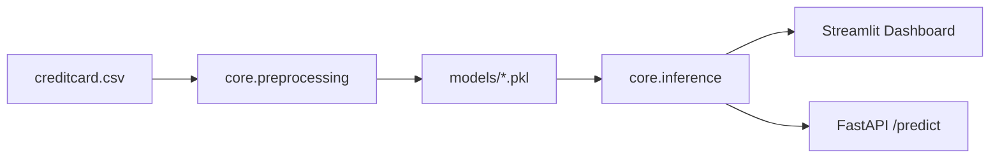

# AI-Powered Banking Fraud Detection System (Production Upgrade)

Production-grade fintech fraud detection stack with anomaly detection, calibrated classification, weighted ensembling, explainability, Streamlit UI, and FastAPI service.

## Problem Statement
Banks need low-latency fraud scoring with strong recall, interpretable outputs, and reliable operations under severe class imbalance.

## Architecture


## Key ML Improvements
- Full Kaggle dataset support
- Imbalance handling with SMOTE fallback + class-weighted learners
- Calibrated probabilities (`CalibratedClassifierCV`)
- Dynamic threshold tuning from precision-recall curve
- Extra metrics: ROC-AUC, PR-AUC, balanced accuracy
- Weighted ensemble (`isolation_forest`, `random_forest`, optional `xgboost`)
- Explainability: SHAP (if available) with permutation fallback

## Modular Structure
- `core/preprocessing.py`: schema checks, scaling, split, SMOTE, single-payload prep
- `core/inference.py`: model loading, dynamic selection, ensemble scoring, explanations
- `core/explainability.py`: SHAP/permutation local explanation
- `core/logger.py`: centralized logging
- `api/main.py`: FastAPI `GET /health`, `POST /predict`
- `app/streamlit_app.py`: advanced dashboard with threshold/model comparison/charts/history
- `tests/`: preprocessing/inference pytest coverage

## Setup
```bash
python3 -m venv .venv
source .venv/bin/activate
pip install -r requirements.txt
```

## Data
Place Kaggle `creditcard.csv` in `data/`.
Dataset source: [Kaggle Credit Card Fraud Detection](https://www.kaggle.com/datasets/mlg-ulb/creditcardfraud)

## Run Streamlit
```bash
streamlit run app/streamlit_app.py
```
Features:
- model selector (`isolation_forest`, `random_forest`, `xgboost`, `ensemble`)
- threshold slider
- fraud gauge + explanation text + top feature impacts
- model comparison table and charts
- ROC + PR curves
- transaction history table

## Run API
```bash
uvicorn api.main:app --reload --port 8000
```

### Endpoints
- `GET /health`
- `POST /predict`

Sample request:
```json
{
  "Time": 1000,
  "Amount": 250.5,
  "features": {"V1": 0.1, "V2": -0.2, "V3": 0.0, "V4": 0.7, "V5": -0.1, "V6": 0.2, "V7": 0.3, "V8": 0.1, "V9": 0.0, "V10": -0.3, "V11": 0.5, "V12": -0.2, "V13": 0.1, "V14": -0.8, "V15": 0.0, "V16": 0.2, "V17": -0.6, "V18": 0.1, "V19": 0.0, "V20": 0.1, "V21": 0.0, "V22": 0.0, "V23": 0.0, "V24": 0.0, "V25": 0.0, "V26": 0.0, "V27": 0.0, "V28": 0.0},
  "model": "ensemble",
  "threshold": 0.4
}
```

## Tests
```bash
pytest -q
```

## Docker
```bash
docker build -t fraud-detection-ai .
docker run -p 8000:8000 fraud-detection-ai
```

## Notes for Fintech-Grade Extensions
- add feature drift monitors and scheduled retraining
- integrate model registry + CI/CD promotion gates
- add request auth/rate limits and audit-grade logs
- add canary model rollout with shadow evaluations
